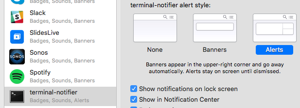

# today
A modern [Agenda](https://en.wikipedia.org/wiki/Lotus_Agenda)

## Installation

## Notes

Depending on your system and configuration the notifications may not persist -- they will display for some number of seconds then disappear.

If you'd like keep your item notifications "sticky", you may need to configure the notification system of your OS to allow that privelege for your terminal.

On OSX for example you would visit `system preferences > notifications` and enable `Alerts` for your terminal:

